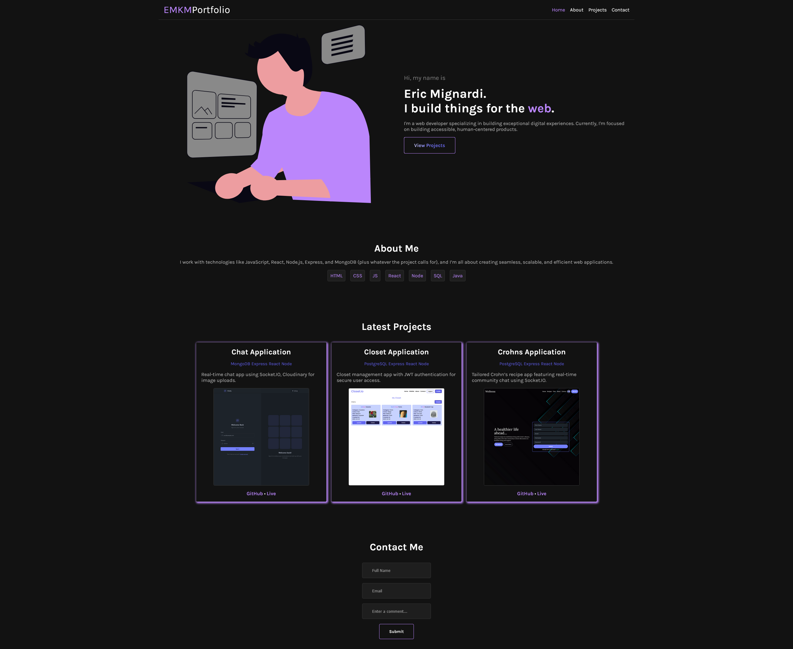

## 🎯 Project Overview

portfolio is a fast, responsive personal website built with **HTML**, **CSS**, and **JavaScript**. It showcases projects, skills, and contact information in a clean, modern layout designed for easy navigation and professional presentation.

## 💡 Key Features

- 🧑‍💻 Personal introduction and bio section
- 💼 Projects showcase with live links and descriptions
- 📱 Fully responsive design for desktop, tablet, and mobile
- 🌙 Dark mode toggle for user accessibility
- ✉️ Contact form with form validation
- ⚡ Optimized for performance and fast load times

## 🛠️ Technologies Used

- **HTML5** — Semantic page structure
- **CSS3** — Custom styling and layout design
- **JavaScript (ES6)** — Interactivity and DOM manipulation
- **Flexbox & Grid** — Responsive layout techniques
- **Font Awesome** — Icons and visual elements
- **GitHub Pages** — Hosting and deployment

## 📸 Screenshots

